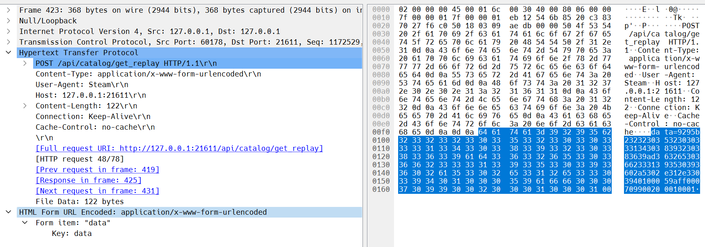

# A Brief Foray into API Reverse Engineering and HTTP Requests

One of the primary features of -STRIVE- stats is that it can directly interact with the official API used by Guilty Gear -STRIVE- (GGST). However, to achieve this functionality, knowledge about the data that the API accepts, and returns is needed to properly map and use the desired data. Given that this API is private (in the sense that no public documentation is available), we must perform some tasks to generate information needed for the features.

It should be noted that there already exist open-source projects and resources dedicated to interfacing with the Guilty Gear -STRIVE- API. I will be referencing those projects and resources throughout this document as the groundwork laid by those projects have been instrumental in understanding where to begin and how to proceed. Tools and references will be hyperlinked as they are discussed.

## Dolphins and Sharks

Since this feature involves interacting with a web API, it is important to know the mechanism used to interact with it: HTTP Requests. The key issue is not how the HTTP request works, but rather what do we send to the API for it to consider as a proper request. For most web APIs, you would need to know the URL to send the request to, the HTTP method the request uses (`GET`, `POST`, etc.), the headers of the request (describes things about the request), and the body of the request if applicable. This information is not easily accessible without some tooling we need to scrape information at lower levels.

The first tool is called [Totsugeki](https://github.com/optix2000/totsugeki) (named after the catchphrase of May’s signature move where she rides a dolphin) is useful as it patches GGST to use a local proxy server that creates a TCP Keep-Alive connection to send the game’s API Requests over. While the primary utility of Totsugeki is for decreasing game load times by reducing the number of individual requests made during startup (which was initially uncovered by /u/TarballX [here](https://www.reddit.com/r/Guiltygear/comments/oaqwo5/analysis_of_network_traffic_at_game_startup/)), it logs all of the requests the proxy receives from GGST, which allows us to understand what data we can retrieve from the API at a higher level.

The second tool is [Wireshark](https://www.wireshark.org/), the leading open-source network analyzer tool. This tool allows us to capture all network packets at an interface-level, which is compounded on top of the various tools to dissect and reconstruct various different network protocol calls. With this in mind, we can cast a net of all traffic going through a network interface while GGST is proxied by Totsugeki, thus giving us all of the information needed about the API.

## The Numbers, What do they mean?????

After some parsing through the requests, I found some relevant requests for what I want to do. The first is a request to the server for getting replays:

This request gave me some useful information that we need to send requests to the API:

- The API URL to send the request to (`api/catalog/get_replay`)
- The HTTP version/method used for the request (`HTTP/1.1 POST`)
- The request uses the following headers (which the API might be strict about)
  - `Content-Type: application/x-www-form-urlencoded` - Defines what type of data is in the body of the request
  - `User-Agent: Steam` - Defines the client that sent the request
  - `Cache-Control: no-cache` - Tells the server to not cache the request
- The request has some type of body that is defined by `data=<data here>`

So we have everything needed except the most critical component: the body. I would have been stuck here and dropped this feature if the community hadn't figured out what encoding the body was sent in. [ggst-api-rs](https://github.com/halvnykterist/ggst-api-rs), a wrapper for the GGST API written in Rust and used for the site [Rating Update](https://ratingupdate.info) has already answered that question in the README:

> To collect replays a POST request has to be made to [https://ggst-game.guiltygear.com/api/catalog/get_replay](https://ggst-game.guiltygear.com/api/catalog/get_replay). The body should be of the content type application/x-www-form-urlencoded and contain a single entry with the key data which is hex encoded messagepack. The response is plain messagepack. Rust types are defined for both the request and response with all know fields having readable names.
